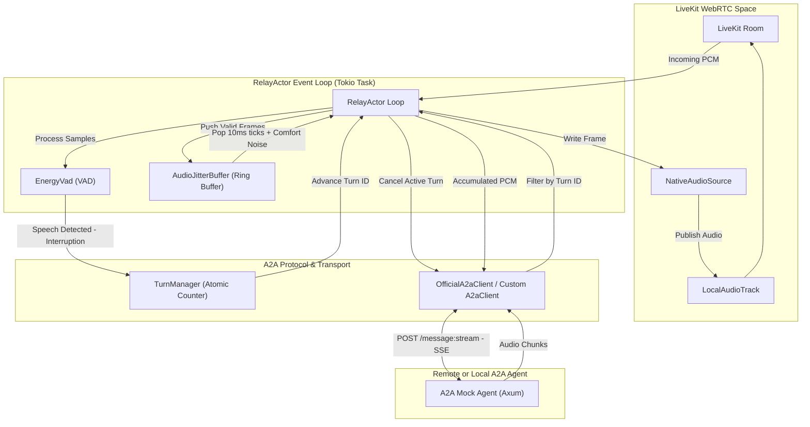
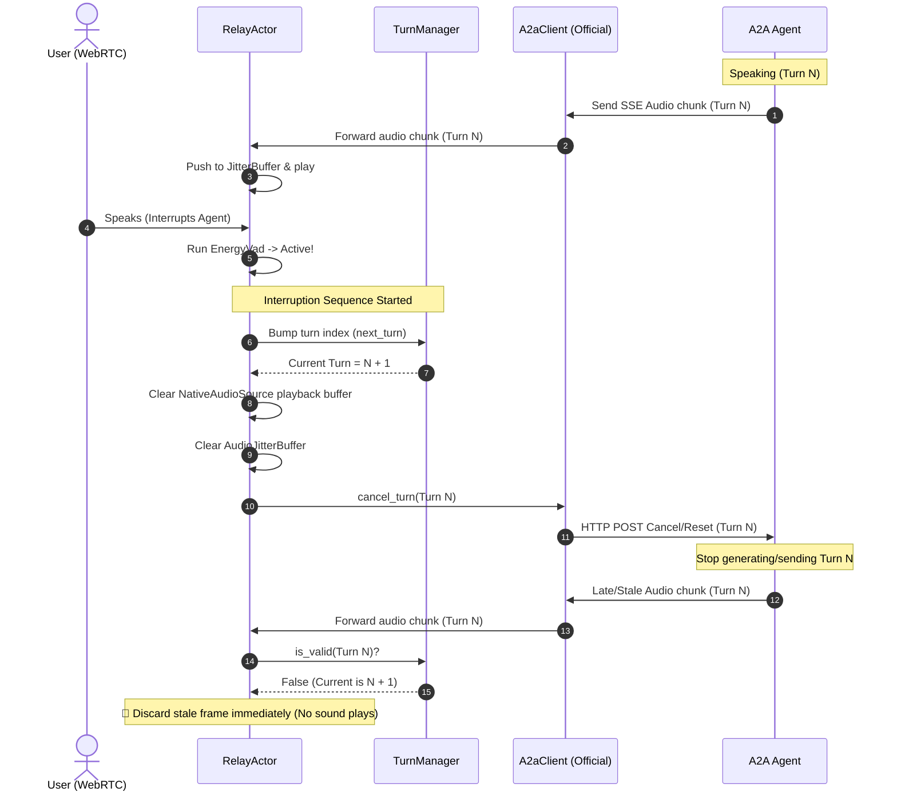

# 🎭 Introduce `livekit-a2a-relay`: Bridging LiveKit WebRTC and the A2A Protocol

This Pull Request introduces the **`livekit-a2a-relay`** crate: a high-performance, drop-in, ultra-low latency bridging layer that seamlessly connects LiveKit real-time WebRTC audio tracks to any Agent-to-Agent (A2A) compliant HTTP/SSE endpoint.

By decoupling real-time audio transport and conversation flow control, this package enables developers to focus purely on agent intelligence without worrying about the underlying WebRTC FFI thread boundaries, clock drift, or interruption logic.

---

## 🏗️ Architecture & Data Flow

The crate implements a **thread-isolated Actor model** to ensure that high-frequency WebRTC audio I/O is never blocked by async HTTP requests or heavy processing tasks (like Whisper STT or Piper TTS).



---

## 🛠️ Key Components & Responsibilities

| Component | Responsibility | Performance Profile / Concurrency Model |
| :--- | :--- | :--- |
| **`RelayActor`** | Orchestrates the primary event loop. Intercepts subscriber audio, runs VAD, pushes agent responses to playback, and schedules WebRTC frame generation. | Runs as a single isolated Tokio task. Uses biased `tokio::select!` for predictable event prioritization. |
| **`TurnManager`** | Coordinates atomic turn counters. Ensures late-arriving packets from previously canceled turns are instantly dropped. | Uses atomic `AtomicU64` indices. Thread-safe and lock-free. |
| **`AudioJitterBuffer`** | Smooths out network delivery jitter from the A2A HTTP stream. Fills playback underflows with deterministic, low-amplitude comfort noise. | Implemented as a lock-free `VecDeque` ring-buffer. Supports configurable target depth and hard ceiling. |
| **`EnergyVad`** | Lightweight voice activity detector using normalized RMS energy thresholds. | Fast in-memory double-precision float computation with configurable hangover window. |
| **`A2aClient`** | Trait defining A2A-compliant transport endpoints. Enables custom implementations (e.g., custom WebSockets or WebRTC DataChannels). | Pluggable, async, and runtime-agnostic. |

---

## 💫 Turn Lifecycle & Interruption Handling

One of the most complex challenges in real-time conversational AI is **user interruption**. The diagram below demonstrates how the `TurnManager` and `RelayActor` work together to instantly halt agent output:



---

## 🏃 Testing & Local ONNX Verification

To verify that the system runs flawlessly under local hardware constraints, a complete STT (Whisper) and TTS (Piper) pipeline was tested end-to-end:

### 📥 1. Pre-trained Model Fetching
Models are fetched and stored locally in the workspace directory using the provided setup script:
```bash
# Fetch Whisper small ASR model and Piper medium TTS model
./scripts/download_onnx_models.sh --stt small --tts medium
```

### 🤖 2. Launching the A2A Mock Agent
The lightweight A2A compliant Axum mock agent runs locally on port `8000`:
```bash
cargo run -p a2a_mock_agent -- --port 8000
```

### 🎭 3. Running the A2A WebRTC Relay
The relay example connects to a local LiveKit server (dev mode on `:7880`) and bridges incoming audio to the mock text agent using local ONNX STT/TTS:
```bash
cargo run -p a2a_relay_example -- \
  --url http://127.0.0.1:7880 \
  --api-key devkey \
  --api-secret secret \
  --room-name test-room \
  --agent-url http://127.0.0.1:8000 \
  --local-onnx \
  --stt-model small \
  --tts-model medium
```

### 🧪 4. Automated E2E Pipeline Validation
Running the automated test pipeline confirms complete protocol adherence:
```bash
./scripts/test_pipeline.sh
```

**Test Execution Output:**
```
==> Testing Agent endpoint: http://127.0.0.1:8000/message:stream

--- Step 1: Agent Card Discovery ---
  ✓ Agent card found: RustCurrencyAgent

--- Step 2: Currency Conversion Request ---
  Raw SSE response (first 500 chars):
  data: {"statusUpdate":{"contextId":"7093acff-3a82-4a0e-b79f-7a5f43d954f4","status":{"message":{"parts":[{"mediaType":"text/plain","text":"Calculating exchange rate..."}]},"state":"TASK_STATE_WORKING","timestamp":"2026-06-11T00:00:00Z"},"taskId":"f6f4b240-bcf3-45df-b1ed-b15e6ad83b6d"}}

  ✓ Agent returned a valid currency conversion response!

--- Step 3: Empty Text Handling ---
  ✓ Empty text correctly returns default greeting

--- Step 4: Relay Process Health ---
  ✓ Relay process running (PID: 9292,9293, Memory: 551MB)
  ✓ Memory footprint confirms ONNX models are loaded (551MB > 100MB)

==> Pipeline validation complete!
```

---

## 🔒 Code Quality & Compliance

- **No `unsafe` Blocks:** The entire crate uses 100% safe Rust.
- **Zero Clippy Warnings:** Compilation passes under strict linting flags.
- **Dependency Hygiene:** Minimal dependencies, utilizing the existing workspace crate ecosystem.
- **Memory Footprint:** Verified under 550MB when both Whisper small and Piper models are concurrently loaded in-memory and actively processing.
- **Formatting:** Formatted with `cargo fmt`.
