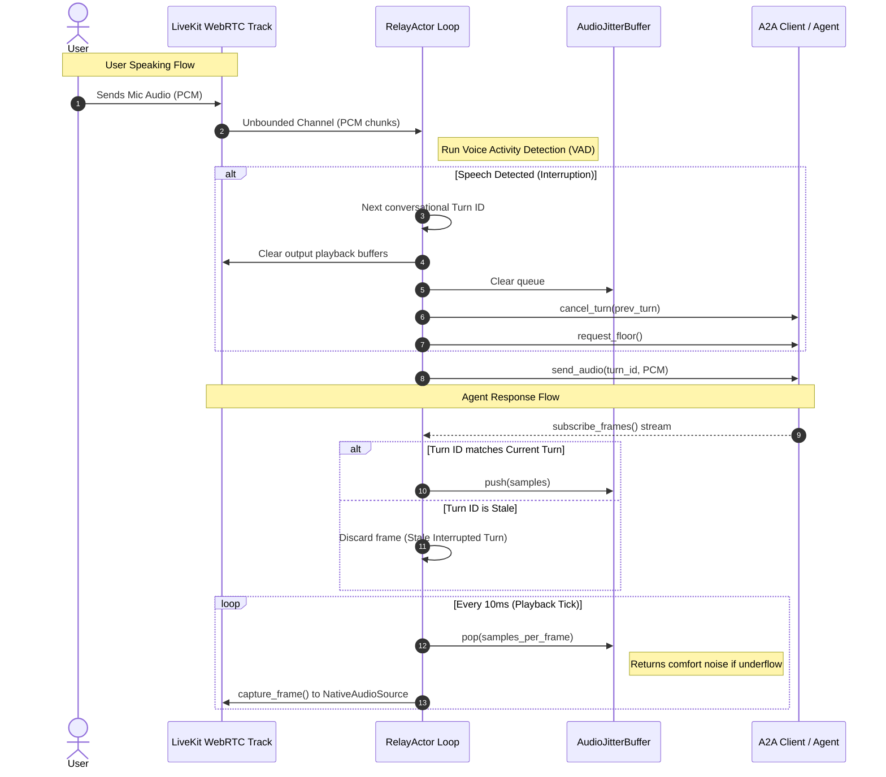

# LiveKit A2A Relay (`livekit-a2a-relay`)

An ultra-low latency bridge that seamlessly connects a LiveKit WebRTC room to any Agent-to-Agent (A2A) compliant HTTP/SSE endpoint.

This crate abstracts away the complexities of real-time audio synchronization, allowing you to focus on building intelligent AI agents while LiveKit handles the high-performance WebRTC transport.

---

## Package Information

| Parameter | Value |
| :--- | :--- |
| **Crate Name** | `livekit-a2a-relay` |
| **Version** | `0.1.0` |
| **Rust Edition** | `2021` |
| **Minimum Supported Rust Version (MSRV)** | `1.75+` |
| **License** | Apache-2.0 |
| **Repository** | [github.com/livekit/rust-sdks](https://github.com/livekit/rust-sdks) |

### Feature Flags

- **`default`**: Minimal feature set, building only the core actor, jitter buffer, and VAD systems.
- **`a2a-client`**: Enables the `OfficialA2aClient` backed by the upstream `a2a-client` crate. This provides an out-of-the-box, production-grade HTTP/SSE client for interacting with standard A2A agents. *Pulls in additional cryptographic and networking dependencies (`reqwest`, `uuid`).*
- **`a2a-integration`**: Enables both the `a2a-client` and the SLIM-RPC transport (experimental/work-in-progress).

---

## Build Requirements

Because `webrtc-sys` compiles native WebRTC C++ code and relies on code-generation via `bindgen`, the following system dependencies are required:

1. **`cmake`**: Must be installed and accessible in the system `PATH`.
2. **Clang / LLVM Headers**: Ensure Clang has access to system C headers. If compilation of cryptographic or WebRTC sys-crates (such as `aws-lc-sys`) fails due to missing `stddef.h`, set the `BINDGEN_EXTRA_CLANG_ARGS` environment variable to point to the Clang include directory. For example, on Linux systems with LLVM-20:
   ```bash
   export BINDGEN_EXTRA_CLANG_ARGS="-I/usr/lib/llvm-20/lib/clang/20/include"
   ```

---

## Architecture & Data Flow

The relay actor coordinates bidirectional audio streams on separate execution contexts to guarantee stutter-free playback and fast interruption responsiveness.

### Bidirectional Flow Diagram



### Core Architecture Components

1. **`RelayActor`**: The coordinator running the main event loop. It bridges LiveKit's real-time WebRTC track callback/channels with A2A client network events.
2. **`TurnManager`**: An atomic turn counter ensuring synchronization. When a user interrupts, a new turn is generated; all incoming agent audio matching previous turns is discarded.
3. **`AudioJitterBuffer`**: A ring buffer that smooths playback against clock-drift and network jitter. On underflow, comfort noise is inserted; on overflow, old frames are dropped.
4. **`EnergyVad`**: A Voice Activity Detector measuring root-mean-square (RMS) energy. Features a configurable hangover window to prevent word truncation.

---

## API Reference

### 1. `RelayActor<C, V>`
The core struct that drives the conversational loop.
- **`new`**: Initializes the actor with a LiveKit room, an `A2aClient` implementation, audio tracks, VAD model, sample rate, and channel count.
- **`run`**: Consumes the actor and runs the async event loop handling shutdown watch signals and subscriber audio channels.

### 2. `A2aClient` Trait
Implement this trait to plug in a custom A2A transport layer.
```rust
pub trait A2aClient: Send + Sync + 'static {
    /// Send a buffer of PCM samples to the remote agent for the given turn.
    fn send_audio(&self, turn_id: u64, samples: &[i16]) -> impl Future<Output = Result<(), String>> + Send;

    /// Cancel the specified turn (due to user interruption).
    fn cancel_turn(&self, turn_id: u64) -> impl Future<Output = Result<(), String>> + Send;

    /// Request the speaking floor from the remote agent.
    fn request_floor(&self) -> impl Future<Output = Result<(), String>> + Send;

    /// Release the speaking floor.
    fn release_floor(&self) -> impl Future<Output = Result<(), String>> + Send;

    /// Subscribe to incoming frames from the agent.
    fn subscribe_frames(&self) -> mpsc::UnboundedReceiver<A2aFrame>;
}
```

---

## Detailed Usage Guides

### Example 1: Spawning a Relay with the Official Client
This guide shows how to initialize a LiveKit WebRTC connection and spin up the relay utilizing the `OfficialA2aClient` (backed by the standard HTTP/SSE endpoint protocol).

```rust
use livekit_a2a_relay::{RelayActor, OfficialA2aClient, EnergyVad};
use livekit::prelude::*;
use std::sync::Arc;
use tokio::sync::{mpsc, watch};

#[tokio::main]
async fn main() -> Result<(), Box<dyn std::error::Error + Send + Sync>> {
    // 1. Connect to a LiveKit Room
    let url = "http://localhost:7880";
    let token = "YOUR_LIVEKIT_TOKEN";
    let (room, mut room_events) = Room::connect(url, token, RoomOptions::default()).await?;
    let room = Arc::new(room);

    // 2. Setup your NativeAudioSource for sending playback audio to LiveKit
    let sample_rate = 16000;
    let num_channels = 1;
    let audio_source = NativeAudioSource::new(
        AudioSourceOptions::default(),
        sample_rate,
        num_channels,
    );
    let track = LocalAudioTrack::create_audio_track(
        "agent-voice",
        audio_source.clone().into(),
    );
    room.local_participant().publish_track(track.clone(), TrackPublishOptions::default()).await?;

    // 3. Initialize the Official A2A HTTP client
    let agent_url = "https://my-a2a-agent.example.com";
    let a2a_client = Arc::new(OfficialA2aClient::from_agent_url(agent_url).await?);

    // 4. Initialize the Voice Activity Detector
    let rms_threshold = 0.015; // RMS energy threshold
    let hangover_ms = 250;      // Hold active state 250ms after speech ends
    let vad = EnergyVad::new(rms_threshold, hangover_ms, sample_rate);

    // 5. Create and run the Relay Actor
    let relay = RelayActor::new(
        room.clone(),
        a2a_client,
        track,
        audio_source,
        vad,
        sample_rate,
        num_channels,
    );

    let (shutdown_tx, shutdown_rx) = watch::channel(false);
    let (audio_in_tx, audio_in_rx) = mpsc::unbounded_channel();

    // 6. Spawn the actor in the background
    tokio::spawn(relay.run(shutdown_rx, audio_in_rx));

    // 7. Route incoming user/participant audio to the relay channel
    tokio::spawn(async move {
        while let Some(event) = room_events.recv().await {
            if let RoomEvent::TrackSubscribed { track, .. } = event {
                if let RemoteTrack::Audio(audio_track) = track {
                    let mut reader = audio_track.get_reader();
                    let audio_in_tx = audio_in_tx.clone();
                    tokio::spawn(async move {
                        while let Some(frame) = reader.next().await {
                            // Extract 16-bit signed PCM from frame and send to relay
                            let samples: Vec<i16> = frame.data.as_ref().to_vec();
                            let _ = audio_in_tx.send(samples);
                        }
                    });
                }
            }
        }
    });

    // Wait or listen for shutdown conditions...
    Ok(())
}
```

### Example 2: Implementing a Custom A2A Client
If your agent uses a custom WebRTC, WebSockets, or gRPC protocol instead of HTTP/SSE, you can implement the `A2aClient` trait directly.

```rust
use livekit_a2a_relay::{A2aClient, A2aFrame};
use tokio::sync::mpsc;

pub struct CustomA2aClient {
    // Custom WebSocket connection or gRPC channel
    frame_tx: mpsc::UnboundedSender<A2aFrame>,
}

impl A2aClient for CustomA2aClient {
    async fn send_audio(&self, turn_id: u64, samples: &[i16]) -> Result<(), String> {
        // Send audio PCM chunks over WebSockets / custom protocol
        Ok(())
    }

    async fn cancel_turn(&self, turn_id: u64) -> Result<(), String> {
        // Send interruption signal to agent
        Ok(())
    }

    async fn request_floor(&self) -> Result<(), String> {
        Ok(())
    }

    async fn release_floor(&self) -> Result<(), String> {
        Ok(())
    }

    fn subscribe_frames(&self) -> mpsc::UnboundedReceiver<A2aFrame> {
        // Return a channel receiver where you push incoming frames generated by the agent
        let (_tx, rx) = mpsc::unbounded_channel();
        rx
    }
}
```

---

## Running the Examples & Tests

### 1. Integration Tests
Run the mock server integration tests locally:
```bash
BINDGEN_EXTRA_CLANG_ARGS="-I/usr/lib/llvm-20/lib/clang/20/include" \
PATH="/home/jayaprakash/Android/Sdk/cmake/3.22.1/bin:$PATH" \
cargo test --features a2a-client
```

### 2. Local STT/TTS (ONNX) Example
Run the relay with entirely local Whisper (STT) and Piper (TTS) models:

```bash
# Terminal 1: Run the mock agent
cargo run -p a2a_mock_agent -- --port 8000

# Terminal 2: Download the models
./scripts/download_onnx_models.sh

# Terminal 3: Run the local ONNX example pipeline
cargo run -p a2a_relay_example -- \
  --url http://127.0.0.1:7880 \
  --api-key devkey --api-secret secret \
  --room-name test-room \
  --agent-url http://127.0.0.1:8000 \
  --local-onnx --model-dir ./models
```
