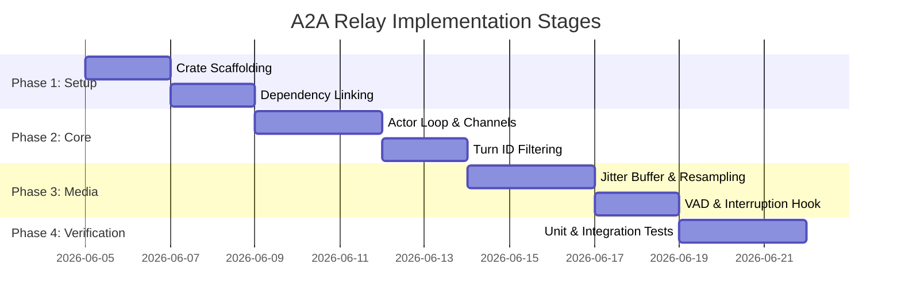

# Implementation Plan: Ultra-Low Latency LiveKit A2A Relay Agent

This document outlines the detailed architectural design and implementation plan for deploying an **Agent2Agent (A2A) Protocol Relay** as a workspace crate inside the LiveKit Rust SDK codebase. It specifically addresses real-time audio synchronization, thread isolation, low-latency VAD interruption, backpressure, and multi-agent floor control.

---

## 1. System Architecture & Threading Model

To ensure that real-time WebRTC audio processing is never blocked by A2A network operations or JSON/gRPC serialization, we isolate execution across distinct thread pools.

```
                  ┌────────────────────────────────────────────────────────┐
                  │                TOKIO RUNTIME (Multi-Threaded)          │
                  │                                                        │
                  │   ┌────────────────────┐      ┌────────────────────┐   │
                  │   │   A2A gRPC Loop    │      │  LLM / TTS Relay   │   │
                  │   │   (a2a-grpc/slim)  │      │  (JSON-RPC / IPC)  │   │
                  │   └─────────┬──────────┘      └─────────┬──────────┘   │
                  │             │                           │              │
                  │             └─────────────┬─────────────┘              │
                  │                           │                            │
                  │                           ▼ Async Channel              │
                  └───────────────────────────┼────────────────────────────┘
                                              │ 
                                              │ (tokio::sync::mpsc)
                                              │ (Turn-Filtered Queue)
                                              │
                  ┌───────────────────────────┼────────────────────────────┐
                  │               WEBRTC / NATIVE SYSTEM POOL              │
                  │                           │                            │
                  │                           ▼                            │
                  │             ┌──────────────────────────┐               │
                  │             │  RelayActor (Main Actor) │               │
                  │             └─────┬──────────────┬─────┘               │
                  │                   │              │                     │
                  │                   ▼              ▼                     │
                  │             ┌──────────┐    ┌──────────┐               │
                  │             │ Local    │    │ Native   │               │
                  │             │ VAD      │    │ Jitter   │               │
                  │             │ Engine   │    │ Buffer   │               │
                  │             └──────────┘    └──────────┘               │
                  └────────────────────────────────────────────────────────┘
```

### Thread Pools Division
1. **WebRTC Media Thread Pool**: Handles hardware capture and rendering callbacks. Must run lock-free.
2. **A2A Client Thread Pool (Tokio)**: Dedicated to network I/O, gRPC channel polling, and A2A payload serialization/deserialization.
3. **Local VAD / Filter Loop**: Intercepts microphone/incoming audio frames in the WebRTC pipeline synchronously using `AudioFilterPlugin` or a lightweight task.

---

## 2. Core Rust Structs & Component Design

The implementation will reside in a new workspace crate `livekit-a2a-relay`. Here are the core structures:

### A. The main relay actor: `RelayActor`
```rust
use std::sync::Arc;
use tokio::sync::{mpsc, watch};
use livekit::prelude::*;

pub struct RelayActor {
    room: Room,
    a2a_client: a2a_client::Client,
    turn_manager: Arc<TurnManager>,
    jitter_buffer: AudioJitterBuffer,
    floor_controller: FloorController,
    
    // Channel for outgoing audio frames to be written to WebRTC
    audio_source: NativeAudioSource,
    
    // Control channels
    shutdown_rx: watch::Receiver<bool>,
}
```

### B. Interruption Turn Manager: `TurnManager`
Tracks the current conversational sequence and drops late packets from previous turns.
```rust
use std::sync::atomic::{AtomicU64, Ordering};

pub struct TurnManager {
    current_turn: AtomicU64,
}

impl TurnManager {
    pub fn new() -> Self {
        Self { current_turn: AtomicU64::new(0) }
    }

    pub fn next_turn(&self) -> u64 {
        self.current_turn.fetch_add(1, Ordering::SeqCst) + 1
    }

    pub fn current_turn(&self) -> u64 {
        self.current_turn.load(Ordering::SeqCst)
    }

    pub fn is_valid(&self, packet_turn: u64) -> bool {
        packet_turn == self.current_turn()
    }
}
```

### C. Audio Jitter & Drift Buffer: `AudioJitterBuffer`
Mitigates sample clock drift between the remote TTS generation and local WebRTC rendering.
```rust
use std::collections::VecDeque;

pub struct AudioJitterBuffer {
    buffer: VecDeque<i16>,
    target_depth: usize, // e.g., 60ms (2880 samples at 48kHz)
    max_depth: usize,    // e.g., 200ms (9600 samples)
}

impl AudioJitterBuffer {
    pub fn push(&mut self, data: &[i16]) {
        self.buffer.extend(data);
        
        // Backpressure trigger if buffer grows too large
        if self.buffer.len() > self.max_depth {
            // Drop oldest packets or request backpressure throttle
            let excess = self.buffer.len() - self.max_depth;
            self.buffer.drain(..excess);
        }
    }

    pub fn pop(&mut self, output: &mut [i16]) -> usize {
        let read_len = std::cmp::min(self.buffer.len(), output.len());
        for (i, sample) in self.buffer.drain(..read_len).enumerate() {
            output[i] = sample;
        }
        
        // Fill the rest with comfort noise / silence if underflow occurs
        if read_len < output.len() {
            for i in read_len..output.len() {
                output[i] = 0; // Comfort silence
            }
        }
        read_len
    }
}
```

---

## 3. Detailed Logic for Edge Cases

### Edge Case 1: Interruption Race Condition (Stale Frames)

When the user starts speaking, the agent must interrupt instantly. 

```
User Speak ──► [Local VAD] ──► Clear Playback Buffer & Increment Turn ID (e.g. Turn 45)
                                    │
                                    ├──► Send A2A Cancel Frame (Turn 44)
                                    │
A2A Socket ──► [Filter Loop] ───────┼──► Receives A2A Audio Frame (Turn 44)
                                    │        │
                                    │        ▼
                                    │    [Turn 44 != Turn 45] -> DISCARD PACKET (No sound played)
```

1. **Local Detection**: VAD detects speech on the subscriber track.
2. **State Shift**: The `RelayActor` increments `TurnManager.next_turn()`.
3. **Queue Purge**: The `NativeAudioSource` buffer is instantly drained.
4. **Discard Rule**: All incoming gRPC frames carry a `turn_id`. If `packet.turn_id < current_turn`, the frame is dropped immediately at the edge of the socket handler, preventing stale audio playback.

---

### Edge Case 2: Multi-Agent Floor Control

In an A2A multi-agent environment, the agent must not publish audio if it doesn't hold speaking permissions.

```rust
pub struct FloorController {
    is_speaking_allowed: watch::Receiver<bool>,
    local_track: LocalAudioTrack,
}

impl FloorController {
    pub async fn update_floor_state(&self, has_floor: bool) {
        // Mute or unmute the track publication based on floor ownership
        if has_floor {
            self.local_track.unmute().await.unwrap();
        } else {
            self.local_track.mute().await.unwrap();
        }
    }
}
```
* **Protocol Map**: Map A2A floor request responses (gRPC stream) to LiveKit local audio track state.
* **Pre-connection negotiation**: Keep the audio track published but muted. This avoids the 300ms negotiation delay when the agent grabs the floor, ensuring instantaneous unmute and speech start.

---

### Edge Case 3: Backpressure & Buffer Bloat

To prevent latency accumulation under network congestion:
1. Limit `NativeAudioSource` internal queue.
2. If queue size > 200ms, pause the A2A gRPC channel read task (`tokio::task::yield_now` or pausing channel consumers).
3. Under severe network degradation, drop audio blocks rather than buffering them, keeping the conversational latency constant.

---

## 4. Phase-by-Phase Integration Plan



### Phase 1: Crate Setup & Dependencies
* Add `livekit-a2a-relay` to workspace `Cargo.toml`.
* Link `a2a-rs` dependency crates (`a2a`, `a2a-client`, `a2a-slimrpc`).
* Set up linking for `soxr-sys` to support voice rescalings.

### Phase 2: Core Communication Loop
* Implement `RelayActor` and separate gRPC thread runtime.
* Implement `TurnManager` with atomic checks to reject stale frames.
* Bind local IPC/gRPC channel to loop messages.

### Phase 3: WebRTC Audio Integration
* Connect `NativeAudioStream` to push chunks to the A2A stream.
* Connect `NativeAudioSource` with the `AudioJitterBuffer` to feed WebRTC.
* Integrate VAD (e.g., via tract/silero or a basic energy filter plugin) to trigger immediate local mute.

### Phase 4: Testing & Hardening
* Write unit tests simulating clock drift (sending audio at 1.1x speed and checking depth correction).
* Write integration tests simulating user interruptions during speech.
* Validate performance metrics targeting **<50ms local interruption time** and **<5ms relay serialization overhead**.
