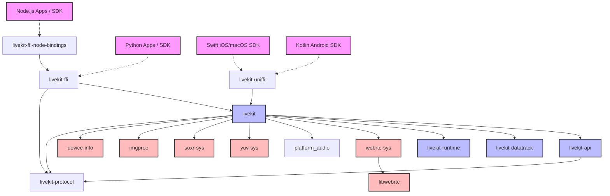

# LiveKit Rust SDK Codebase Insights & Architecture

This document provides a comprehensive analysis and architectural overview of the `rust-sdks` repository. It details how the crates fit together, the design patterns utilized, build-time link configurations, and typical usage flows.

---

## 1. Architectural Overview

The LiveKit Rust SDK workspace is structured as a multi-crate mono-repo. It serves two primary purposes:
1. Providing a clean, idiomatic, and async-runtime-agnostic **Rust Client SDK** for connecting to LiveKit rooms, publishing tracks, and handling real-time audio/video.
2. Providing a **shared native core** (via `livekit-ffi` and `livekit-uniffi`) that powers other LiveKit client SDKs (such as Python and Node.js) through a message-based foreign function interface (FFI) powered by Protobuf.

### Crate Relationship Graph



---

## 2. Crate-by-Crate Analysis

Here is a breakdown of the active crates within the workspace:

### 📦 Core Client & Server SDKs

| Crate | Version | Path | Description |
| :--- | :--- | :--- | :--- |
| **`livekit`** | `0.7.44` | `livekit/` | The primary real-time client SDK. Handles room connection state, participant tracking, publishing/subscribing to tracks, RPC, and data packets. |
| **`livekit-api`** | `0.5.1` | `livekit-api/` | Server-side APIs and token generation. It uses **Twirp** (HTTP-based protobuf protocol) to communicate with LiveKit servers (Room, Ingress, Egress, SIP, Agent Dispatch). |

### 🔌 FFI & Bindings Layer

| Crate | Version | Path | Description |
| :--- | :--- | :--- | :--- |
| **`livekit-ffi`** | `0.12.62` | `livekit-ffi/` | The internal FFI server. Exposes a unified C ABI (`cabi.rs`) utilizing Protobuf bytes (`FfiRequest` / `FfiResponse` / `FfiEvent`) to control the SDK from other runtimes. |
| **`livekit-ffi-node-bindings`** | - | `livekit-ffi-node-bindings/` | Node.js native addon powered by **napi-rs**. It binds the Javascript runtime to `livekit-ffi` via protobuf messages. |
| **`livekit-uniffi`** | - | `livekit-uniffi/` | Experimental bindings using Mozilla's **UniFFI** tool. Currently exports logging and token generation to Swift, Node.js, and Android. |

### ⚙️ System, Runtime, & Media Utilities

| Crate | Version | Path | Description |
| :--- | :--- | :--- | :--- |
| **`livekit-runtime`** | `0.4.0` | `livekit-runtime/` | A runtime-abstraction layer using Cargo features (`tokio`, `async` [async-std], `dispatcher`) to manage async tasks without locking the SDK to a single engine. |
| **`livekit-protocol`** | `0.7.8` | `livekit-protocol/` | Auto-generated protobuf/serde structs from the LiveKit protocol schema (e.g., room/participant models, SIP, egress, webhook definitions). |
| **`livekit-datatrack`** | `0.1.8` | `livekit-datatrack/` | An internal crate powering high-speed, custom-serializable binary data tracks. |
| **`livekit-wakeword`** | `0.1.0` | `livekit-wakeword/` | ONNX Runtime-powered wake word detection engine ("Hey LiveKit") running PCM audio through Mel Spectrogram -> Embedding -> Classifier steps. |
| **`webrtc-sys`** | `0.3.33` | `webrtc-sys/` | Low-level C++ wrappers linking Google's WebRTC library. Uses `cxx` to build a clean bridge between Rust and C++. |
| **`libwebrtc`** | `0.3.35` | `libwebrtc/` | Manages the downloading and extracting of prebuilt static `libwebrtc` binaries. |
| **`yuv-sys`** | `0.3.14` | `yuv-sys/` | Bindings to `libyuv` for scaling and color space conversion. |
| **`soxr-sys`** | `0.1.3` | `soxr-sys/` | Bindings to the SoX Resampler library. |
| **`imgproc`** | `0.3.19` | `imgproc/` | Image processing helper utilities. |
| **`device-info`** | `0.1.1` | `device-info/` | System/device telemetry wrapper. |

---

## 3. Platform Compilation & Linking Guidelines

Due to target-specific static library linkages (like `libwebrtc` and media framework wrappers), the SDK has critical compiler configurations defined in `.cargo/config.toml`:

* **macOS / iOS / iOS Simulator**:
  * Must be compiled with `-ObjC` linker flags (`link-args=-ObjC`). Failing to do so causes runtime `NSInvalidArgumentException` crashes when WebRTC accesses Objective-C selectors for video codecs.
* **Linux aarch64**:
  * Linked using the `lld` linker (`-fuse-ld=lld`) to successfully link static `libwebrtc.a` binaries.
* **Windows MSVC (`x86_64` & `aarch64`)**:
  * Static links the C++ runtime (`target-feature=+crt-static`).

---

## 4. Key Design Patterns & Conventions

The repository maintains strict style and design guidelines defined in `AGENTS.md`:

### 🏗️ Design Patterns
1. **Async Runtime Agnosticism**: The core `livekit` crate must compile agnostic of the runtime executor, delegated to the `livekit-runtime` crate.
2. **Actor Pattern for Async Tasks**: Model asynchronous components as a struct encapsulating local state with a consuming, asynchronous `run` loop. Auxiliary methods should operate on `&self` to pass tasks to the runner cleanly.
3. **New Type Pattern**: Extensively used to encapsulate raw IDs (like `RoomSid`, `ParticipantSid`, `TrackSid`) into compile-time-safe types.
4. **Smart Pointers**: Clone paths on hot routes should use smart pointers (like `Arc<T>`) instead of deep-copying structures.
5. **Context-Scoped Errors**: Avoid massive, catch-all enums. Prefer smaller enums localized to specific failures (e.g., `TrackError`, `RoomError`).

### 🛡️ Safety Constraints
* Avoid calling `.unwrap()` outside of unit tests. Prefer `.expect("explanation of expected invariant")`.
* Keep `unsafe` code restricted to foreign function interfaces (`webrtc-sys` and `livekit-ffi`).
* Every `unsafe` block must be accompanied by a `// SAFETY:` comment explaining why it is memory-safe (e.g., non-null pointers, valid lifetime bounds).

---

## 5. Core SDK Flow & Examples

### 🔑 Authentication (Token Generation)
```rust
use livekit_api::access_token;

fn generate_token(api_key: &str, api_secret: &str) -> String {
    access_token::AccessToken::with_api_key(api_key, api_secret)
        .with_identity("rust-agent")
        .with_name("Rust Agent")
        .with_grants(access_token::VideoGrants {
             room_join: true,
             room: "my-room".to_string(),
             ..Default::default()
        })
        .to_jwt()
        .unwrap()
}
```

### 🚪 Connecting to a Room and Listening for Events
```rust
use livekit::prelude::*;
use futures::StreamExt;

#[tokio::main]
async fn main() -> Result<(), RoomError> {
    let url = "http://localhost:7880";
    let token = "...";
    
    // Connect to room and get event receiver channel
    let (room, mut events_rx) = Room::connect(url, token, RoomOptions::default()).await?;
    
    // Event loop
    while let Some(event) = events_rx.recv().await {
        match event {
            RoomEvent::ParticipantConnected(participant) => {
                println!("Participant joined: {}", participant.identity());
            }
            RoomEvent::TrackSubscribed { track, publication, participant } => {
                if let RemoteTrack::Video(video_track) = track {
                    let mut stream = NativeVideoStream::new(video_track.rtc_track());
                    tokio::spawn(async move {
                        while let Some(frame) = stream.next().await {
                            // Process video frame (YUV format)
                        }
                    });
                }
            }
            RoomEvent::DataReceived { payload, topic, .. } => {
                println!("Received data on topic {:?}: {} bytes", topic, payload.len());
            }
            _ => {}
        }
    }
    Ok(())
}
```

### 📞 WebRTC Remote Procedure Calls (RPC)
LiveKit supports direct bidirectional RPC between participants (e.g. Browser client calling a backend Rust AI Agent):

```rust
// Registering an RPC handler (Greeter participant)
room.local_participant().register_rpc_method("greet".to_string(), |data| {
    Box::pin(async move {
        println!("Caller: {}", data.caller_identity);
        Ok(format!("Hello, {}! Welcome.", data.payload))
    })
});

// Calling the RPC method (Caller participant)
let response = room.local_participant().perform_rpc(
    PerformRpcData::new("greeter", "greet").with_payload("John Doe")
).await?;
```

---

## 6. FFI Server Architecture

The FFI server plays a vital role for non-Rust client SDKs (like Python and Node.js). 

Instead of writing a custom WebRTC integration for every runtime, LiveKit instantiates a single static `FFI_SERVER` inside Rust.

```
       [Client Runtime (Node/Python)]
                     │
            FfiRequest (Protobuf)
                     ▼
  ┌─────────────────────────────────────┐
  │   livekit-ffi C Entry Point         │
  │   - livekit_ffi_request(data, len)  │
  └──────────────────┬──────────────────┘
                     │  Parses request proto
                     ▼
  ┌─────────────────────────────────────┐
  │   FFI Server (Rust)                 │
  │   - Manages state (Rooms, Tracks)   │
  │   - Performs async operations       │
  └──────────────────┬──────────────────┘
                     │  Fires events asynchronously
                     ▼
  ┌─────────────────────────────────────┐
  │   Callback (FfiEvent Protobuf)     │
  │   - Triggers runtime event loop     │
  └─────────────────────────────────────┘
```

1. **Initialization**: The host language registers a callback function using `livekit_ffi_initialize`.
2. **Synchronous Requests**: The host language sends a serialized `FfiRequest` protobuf message to `livekit_ffi_request`. The server processes it synchronously or spawns an async task, returning a response and storing session handles.
3. **Asynchronous Events**: Internal room events (e.g., track subscription, audio frames, active speakers) are wrapped in `FfiEvent` and fired back to the host language callback asynchronously.
