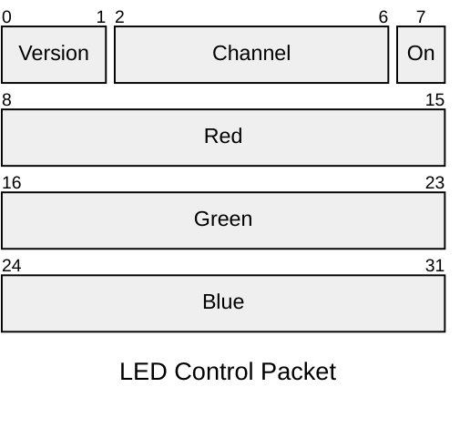

# Send Bytes

Example demonstrating the `send_bytes` method for sending a custom packet to participants in a room.

## Usage

1. Run the example in sender mode:

```sh
export LIVEKIT_URL="..."
export LIVEKIT_TOKEN="<first participant token>"
cargo run -- sender
```

2. In a second terminal, run the example in receiver mode:

```sh
export LIVEKIT_URL="..."
export LIVEKIT_TOKEN="<second participant token>"
cargo run
```

## Custom Packet

This example uses the following hypothetical 4-byte packet structure to teleoperate 16 discrete LED indicators by setting their power states and RGB values:



The [_bitfield-struct_](https://crates.io/crates/bitfield-struct) crate is used to create a type-safe wrapper for getting and setting the bitfields by name.
