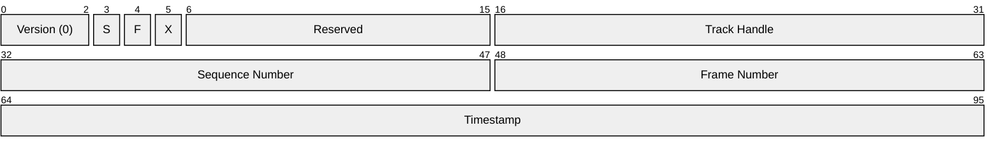
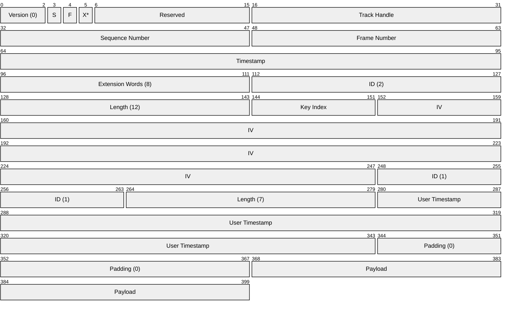

# Data Track Packet (v0)

This specification outlines the packet format used for data tracks, loosely based on RTP.

> [!IMPORTANT]
> The structure of data track packets is an internal implementation detail. This specification is relevant only to those working on the internals.

## Design goals

This format is designed with the following goals:

- **Minimal wire size**: compact, binary fields. Any metadata that does not pertain to individual frames should instead be sent via signaling.

- **High performance encoding/decoding**: in particular, the SFU must be capable of examining potentially tens of thousands of packets per second to make forwarding decisions without fully decoding each packet.

- **Transport agnostic**

- **Maximum utilization of the transport's MTU**

- **Extensibility**: allow for the future addition of new header fields without breaking compatibility with older clients.

## Structure

A data track packet consists of the following sections:

1. Base header
2. Extensions
3. Payload

### Base header

| Name | Bits | Description |
| ---- | ---- | ----------- |
| Version (0) | 3 | Frame header version, initially will be zero. |
| Start Flag (S) | 1 | If set, this is the first packet in a frame. |
| Final Flag (F) | 1 | If set, this is the final packet in a frame. |
| Reserved | 10 | Reserved for future use. |
| Extension Flag (X) | 1 | If set, extensions follow the base header. See format details below. |
| Track Handle | 16 |  Unique identifier of the track the frame belongs to, assigned during signaling. Zero is not a valid track identifier. |
| Sequence Number | 16 | Incremented by the publisher for each packet sent, used to detect missing/out-of-order packets. |
| Frame Number | 16 | The frame this packet belongs to. |
| Timestamp | 32 | Equivalent to RTP media timestamp, uses a clock rate of 90K ticks per second. |

#### Combinations of start and final flag

- If neither flag is set, this indicates a packet is in the middle of a frame.
- If both flags are set, this indicates a packet is the only one in the frame.

### Extensions

If the extension flag in the base header is set, one or more extensions will follow. The format is a variant of [RFC 5285 §4.2](https://datatracker.ietf.org/doc/html/rfc5285#section-4.2) with two notable differences:

1. Instead of a fixed-bit pattern (e.g., *0xBEDE*), a 16-bit integer follows the base header indicating total length of all header extensions and padding expressed in number of 32-bit words (i.e., 1 word = 4 bytes).

2. Available extensions and their format are defined by this specification rather than out-of-band. The following extensions are currently defined:

> [!NOTE]
> Extension lengths are encoded as number of bytes minus one.

### 1. E2EE (length 12)

If included, the packet's payload is encrypted using end-to-end encryption.

| Name | Bits | Description |
| ---- | ---- | ----------- |
| Key Index | 8 | Index into the participant's key ring, used to enable key rotation. |
| IV | 96 | 12-bit AES initialization vector. |

### 2. User Timestamp (length 7)

| Name | Bits | Description |
| ---- | ---- | ----------- |
| User Timestamp | 64 | Application-specific frame timestamp, often will be used to associate capture time. Large enough to accommodate a UNIX timestamp |

## Example

- 50 bytes total
  - Header: 46 bytes
  - Payload: 4 bytes
- Note the padding between the two extensions. This is required per [RFC 5285](https://datatracker.ietf.org/doc/html/rfc5285#section-4.2) to ensure the extension block is word aligned. This example shows it placed between the two extensions, but it is allowed before or after any extension.

## Length calculations

- Header length (bytes): $L_h=4w+12$, where $w$ is the number of extension words
- Maximum payload length (bytes): $L_{p,max}=L_{mtu}-L_h$
